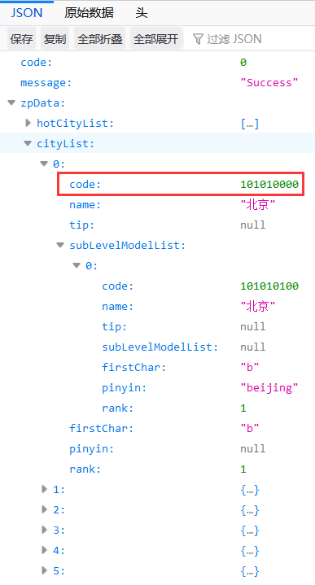
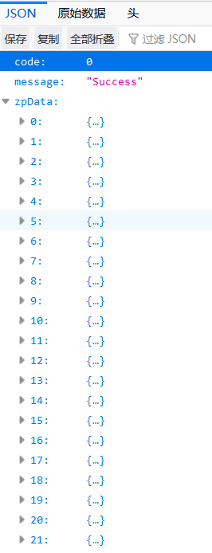
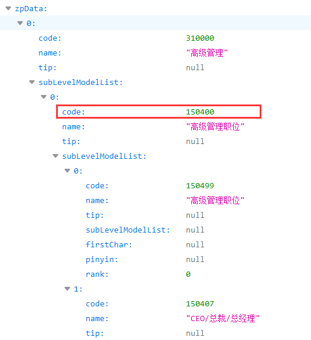
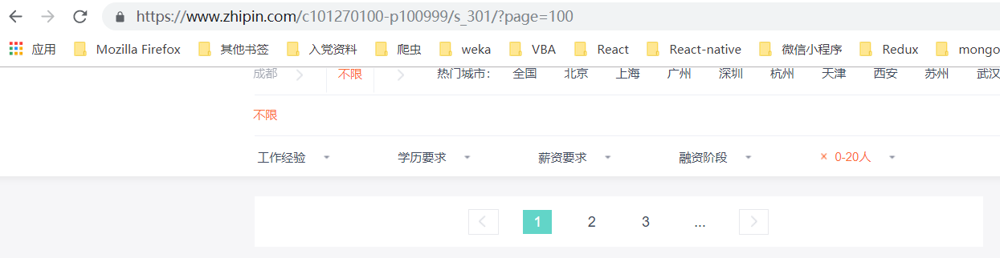

# boss_python

## 1. 目标网站解析

### 1.1 url结构

目标网站结构如图， `https://www.zhipin.com/c101270100-p100999/s_301/?page=2` `注意：此url已经忽略掉了其它多余的字段`  

  

C + 数字 代表地区（此时101270100是成都地区码）全国地区的地区码可用火狐浏览器访问
`https://www.zhipin.com/wapi/zpCommon/data/city.json`获取，前五个代表直辖市，
后面是各自省份，目前只用考虑成都地区即地区码固定是101270100，结构如下：
  


P + 数字 代表职位（此时10999是前端开发职位）全部职位码用火狐访问`https://www.zhipin.com/wapi/zpCommon/data/position.json`获取，
具体有21个大的职位方向，每个方向下有子职位，每个子职位下可能还有具体职位，但是因为网站的推送原因，为了避免公司职位获取重复，
我们只用到第二级的职位code，第二级以下的职位code忽略



只用到第二级的职位code意思就是，循环时，我们只用两层循环就好了，图如下
```python
# zpData是获取的职位数据
for item in zpData：
    for subItem in item.subLevelModelList：
        print (subItem.code)
```


?P=数字 代表当前页码，因为每一页最多展示30条数据，想要获取当前条件下的所有职位信息，必须更改页码，
这里有一个坑，那就是网页一开始不会告诉你一共有多少页，所以要自己考虑循环结束条件

  

随便输入一个大页码后出现如下结果，所以循环的结束条件可以考虑为当前页能够获取的数据项，如果数据项的长度为0，
那么就可以break，跳出循环



S_ + 数字 代表公司规模（此时代表） 此字段存在的意义也是为了防止重复获取公司信息，s_301代表公司规模为0-20人，其它数字依下图一次类推：


### 需要采集的信息


数据说明如下： 

|属性名|字段名|类型|要求
|---|---|---|---|
|comName|公司名字|字符串|非空
|comLink|公司链接|字符串|非空
|jobName|职位名字|字符串|非空
|jobLink|职位链接|字符串|非空
|minSalary|最低工资|整型数字|非空
|maxSalary|最高工资|整型数字|非空
|city|所在城市|字符串|非空
|positionArea|所在区|字符串||	
|positionLoc|所在区下的位置|字符串||
|expDescription|工作经验描述|字符串|非空
|minExp|最少工作经验|整型数字||	
|maxExp|最多工作经验|整型数字||
|education|学历要求|字符串|非空
|direction|公司研究方向|字符串||	
|finSituation|公司融资情况|字符串||	
|comSize|公司规模|字符串|非空

### 循环结构

完整的循环架构大致可以如下:
```python
for 城市 in 城市列表:
    for 一级职位 in 一级职位列表:
        for 二级职位 in 二级职位列表:
            for 公司规模 in 公司规模列表
                while(页面中的数据项不为空时):
                    for i in range(该页数据项个数):
                        采集数据
                        保存到数据库
```

### 项目保存的位置

Python代码存储位置`https://github.com/diken666/boss_python`  
Node代码存储位置`https://github.com/diken666/boss_node`  
Vue代码存储位置`https://github.com/diken666/boss_vue`  

### 文件说明

- def_fuc.py是定义的爬取函数文件
- jobInfo.py是爬虫启动文件
- mongoConnected.py是连接本地mongodb数据库的文件，需要注意的是此文件运行时，需要本地开启mongodb服务，
查看本地是否开启服务，可在浏览器输入 localhost:27017， 如果浏览器显示
“It looks like you are trying to access MongoDB over HTTP on the native driver port.”
表示本地mongodb服务已经开启

### 运行

- python jobInfo.py 爬虫开始
- python mongoConnected.py 输出本地mongodb中的数据
- python saveCityCode.py 保存目前boss直聘上所有城市的code
