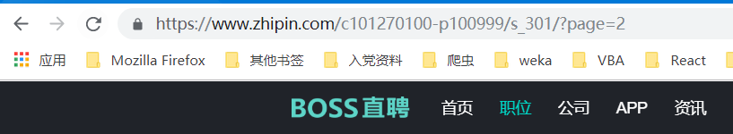

# boss_python

## 1. 目标网站介绍

### 1.1 url结构
    目标网站结构如图， `https://www.zhipin.com/c101270100-p100999/s_301/?page=2` `注意：此url已经忽略掉了其它多余的字段`
    
### 文件说明

- def_fuc.py是定义的爬取函数文件
- jobInfo.py是爬虫启动文件
- mongoConnected.py是连接本地mongodb数据库的文件，需要注意的是此文件运行时，需要本地开启mongodb服务，
查看本地是否开启服务，可在浏览器输入 localhost:27017， 如果浏览器显示
“It looks like you are trying to access MongoDB over HTTP on the native driver port.”
表示本地mongodb服务已经开启

### 运行

- python jobInfo.py 爬虫开始
- python mongoConnected.py 输出本地mongodb中的数据
- python saveCityCode.py 保存目前boss直聘上所有城市的code